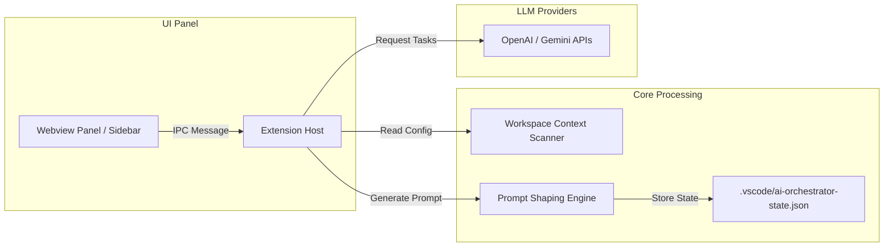

# 🛠️ AI Task Orchestrator

   

## 📖 Overview
AI Task Orchestrator is a custom VS Code extension designed to streamline AI-assisted development workflows. It decomposes user-defined software goals into structured subtask steps and formats optimized prompts customized for different target AI agents (such as Gemini, Claude, Cursor, Codex).

---

## 🚀 Key Features
*   **Prompt Shaping Engine:** Tailors prompt drafts to target agent capabilities (e.g., Codex for file-diff edits, Claude for architecture trade-offs).
*   **Workspace Context Scanning:** Gathers lightweight metadata (active stacks, file counts) to enrich the target prompt context securely without ingesting full source code files.
*   **VS Code Webview Panel:** Implements an asynchronous IPC messaging channel between the sidebar Webview UI and the extension host.
*   **Local State Management:** Persists active project goals, tasks, and prompt states in `.vscode/ai-orchestrator-state.json`.

---

## 🏗️ Architecture & Flow



---

## 📁 Folder Structure

```directory
ai-task-orchestrator/
├── src/
│   ├── ai/             # Core AI provider integrations (OpenAI, Gemini, Mocks)
│   ├── core/           # Workspace context scanning modules
│   ├── extension.ts    # Main extension activation entry point
│   ├── reasoning/      # Prompt structuring and task decomposition logic
│   └── webview/        # IPC message routing and sidebar panel management
├── webview-ui/         # Front-end elements (HTML, CSS, JS)
├── package.json        # VS Code Extension manifest configurations
└── tsconfig.json       # TypeScript build variables
```

---

## 🛠️ Tech Stack & Dependencies
*   **Core:** TypeScript, Node.js, VS Code Extension API
*   **Front-end Panel:** Webview UI (HTML5, Vanilla JS, CSS)
*   **AI Providers:** OpenAI API, Gemini API, Mock Provider (local dry-runs)

---

## ⚙️ Installation & Configuration

### Prerequisites
*   Node.js (18+)
*   VS Code editor

### Local Setup
1. Clone the repository and install dependency nodes:
   ```powershell
   npm install
   ```
2. Build the TypeScript compiler:
   ```powershell
   npm run compile
   ```
3. Run the development extension:
   * Press **F5** in VS Code.
   * Open the command palette in the new window and run: `AI Task Orchestrator: Open Panel`.

---

## 🧪 Testing
Run validation checks and integration test scripts:
```powershell
npm test
```

---

## 📄 License & Contributing
Licensed under the MIT License. Feel free to contribute or raise an issue via a pull request.
